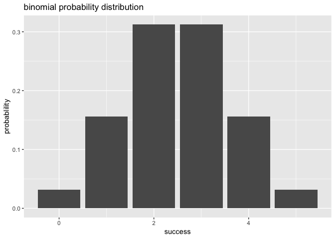

Overview
--------

`"binomial"` is a minimal [R](http://www.r-project.org/) package that provides function for binomial distribution.

-   `bin_choose()` allows you to calulate the number of combinations
-   `bin_probability()` allows you to calulate the probability
-   `bin_distribution()` function gives you a dataframe contains probability
-   `bin_cumulative()` function gives you a dataframe contains probability and cumulative prob
-   `plot()` can create a barplot or a line plot
-   `summary()` can get the summary of a "binvar" object
-   `bin_mean()` `bin_variance()` `bin_mode()` `bin_skewness` `bin_kurtosis()` can specific params for distribution

Motivation
----------

This package is created to help people calculate values in binomial distribution

Installation
------------

Install the development version from GitHub via the package `"devtools"`:

``` r
# development version from GitHub:
# install.packages("devtools") 
# install "binomial" (without vignettes)
devtools::install_github("Kenan-Jiang/binomial")
# install "binomial" (with vignettes)
devtools::install_github("Kenan-Jiang/binomial", build_vignettes = TRUE)
```

Usage
-----

``` r
library(binomial)
# bin_choose
bin_choose(n = 5, k = 2)
#> [1] 10

# bin_probability
bin_probability(success=2, trials=5, prob=0.5)
#> [1] 0.3125

# bin_distribution
bin_distribution(trials = 5, prob = 0.5)
#>   success probability
#> 1       0     0.03125
#> 2       1     0.15625
#> 3       2     0.31250
#> 4       3     0.31250
#> 5       4     0.15625
#> 6       5     0.03125

# bin_cumulative
bin_cumulative(trials = 5, prob = 0.5)
#>   success probability cumulative
#> 1       0     0.03125    0.03125
#> 2       1     0.15625    0.18750
#> 3       2     0.31250    0.50000
#> 4       3     0.31250    0.81250
#> 5       4     0.15625    0.96875
#> 6       5     0.03125    1.00000

# plot
library(ggplot2)
dis1 <- bin_distribution(trials = 5, prob = 0.5)
plot(dis1)
```



``` r

# summary
bin1 <- bin_variable(trials = 10, p = 0.3)
binsum1 <- summary(bin1)
binsum1
#> "Summary Binomial"
#> 
#> Paramaters
#> - number of trials: 10 
#> - prob of success: 0.3 
#> 
#> Measures
#> - mean    : 3 
#> - variance: 2.1 
#> - mode    : 3 
#> - skewness: 0.2760262 
#> - kurtosis: -0.1238095

# functions of measures
bin_mean(trials = 10, prob = 0.3)
#> [1] 3
```
